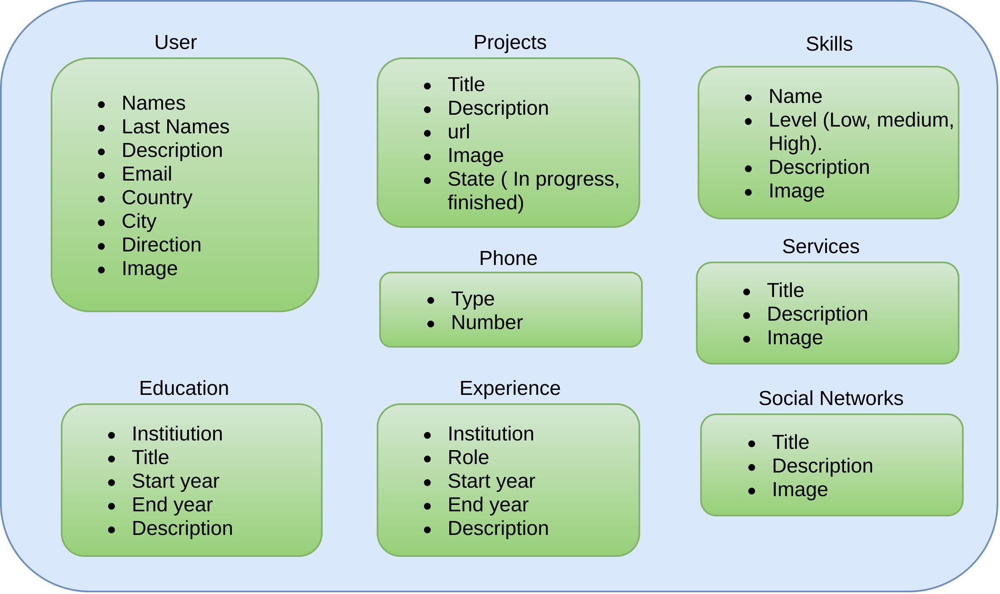
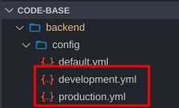
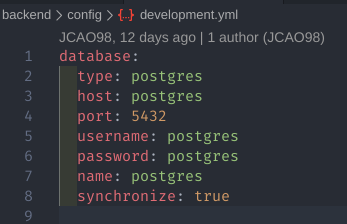
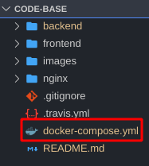

# Portfolio personal project.

## Description

This project has the purpose of implementing different functionalities in order to give a person the possibility to manipulate important or relevant information about him, and then this information will be used to create his own personal portfolio.

The information that you can get, create, update and delete. 

### Architecture

## Technologies
This project has been built with the set of technologies: **Angular**, **NestJS**, **GraphQL**, **Postgres DB** all inside **Docker Containers** and also continuos integration (CI) with **Travis** to Deployment to a VPS with Docker.

### [Angular](https://angular.io/)

  

The frontend application has been built with Angular. 

### [NestJs with GraphQL](https://docs.nestjs.com/graphql/quick-start)

  

The backend application has been built with Nest  and GraphQL with the approach **'code first'** described on Nest Documentation.

### [Postgres DB](https://www.postgresql.org/)

  

The database used in this Project is Postgres, with the image on Docker hub ([Official postgres Image](https://hub.docker.com/_/postgres)). 

We use default postgres database inside Postgres image:

- **host** : postgres
- **type** : postgres
- **username** : postgres
- **name** : postgres
- **password** : postgres
- **port** : 5432

If you want to change this database, you have to go to this file inside backend folder:

and set this credentials with your credentials:

**Remember if you want to change this credentials you have to create the database inside Docker-container**.

### [Docker](https://www.docker.com/)

  

Frontend, Backend, Postgres DB and also Redis run inside Docker-Containers.

## Installation

The only thing that needs to be installed is **Docker** with **Docker Compose**.

### Install Docker

**Ways to install *Docker* on different operating systems**

1. [Linux](https://docs.docker.com/engine/install/)
2. [Mac](https://docs.docker.com/docker-for-mac/install/)
3. [Windows](https://docs.docker.com/docker-for-windows/install/)

After that you have to install **docker-compose**

### Install Docker-compose

**Ways to install *Docker-compose* on different operating systems**

In this [LINK](https://docs.docker.com/compose/install/) you will find the different ways to install docker-compose.

## Usage

Go to the main folder like this: 

Here execute the next command:

`docker-compose up --build` and that's all, now you are running all this project inside **Docker containers**.

## Contributing

Pull requests are welcome. For major changes, please open an issue first to discuss what you would like to change.

## License

[GPL-3.0](https://www.gnu.org/licenses/gpl-3.0.html)

